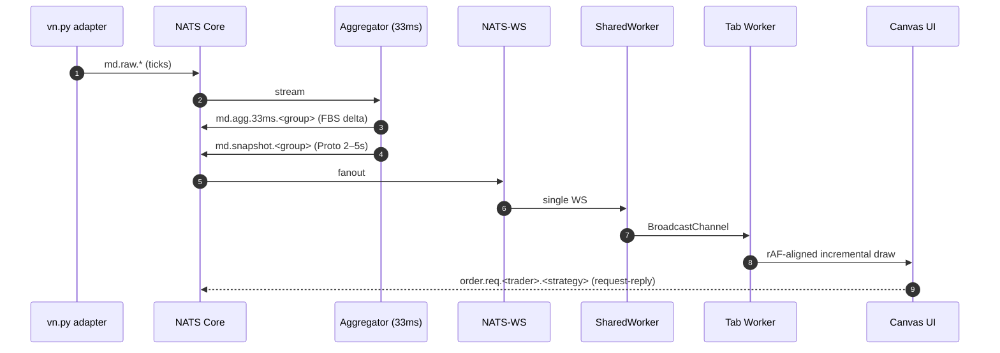

# Architecture Sketch (Mermaid)

Date: 2025-10-17

```mermaid
flowchart TD
  subgraph Source
    ADP[vn.py adapters]\nmd.raw.*
  end

  ADP --> NATS1[(NATS Core)]
  NATS1 --> AGG[Aggregator\n33ms ROI + Top‑K\nProto snapshot 2–5s]

  AGG -->|FBS delta| MD33[NATS md.agg.33ms.<group>]
  AGG -->|Proto snapshot| SNAP[NATS md.snapshot.<group>]

  MD33 --> WS[NATS‑WS Gateway]
  SNAP --> WS

  subgraph Client
    SW[SharedWorker\n1 WS connection]
    T1[Tab A Worker]\nT2[Tab B Worker]
    R1[Decode → SoA RingBuffer]\nR2[Decode → SoA RingBuffer]
    C1[OffscreenCanvas/Canvas]\nC2[OffscreenCanvas/Canvas]
  end

  WS --> SW
  SW -->|BroadcastChannel| T1
  SW -->|BroadcastChannel| T2
  T1 --> R1 --> C1
  T2 --> R2 --> C2

  subgraph Aux
    RISK[Risk/Greeks Svc]\nacct.risk/status 1–2s
    ORD[Order Router]\nNATS request‑reply
    JS[(JetStream)\narchive/replay]
  end

  AGG --> RISK
  RISK --> NATS2[(NATS)] --> WS

  C1 -.->|order.req.<trader>.<strategy>| ORD
  C2 -.->|order.req.<trader>.<strategy>| ORD
  ORD -.->|ack/rep| C1
  ORD -.->|ack/rep| C2

  AGG --> JS
  JS <--> Backoffice[Backoffice / Backtest]

  classDef infra fill:#1f2937,stroke:#93c5fd,color:#e5e7eb;
  classDef client fill:#0f766e,stroke:#6ee7b7,color:#ecfdf5;
  classDef aux fill:#7c2d12,stroke:#fdba74,color:#fff7ed;
  class ADP,NATS1,NATS2,WS,JS infra
  class SW,T1,T2,R1,R2,C1,C2 client
  class RISK,ORD aux
```



